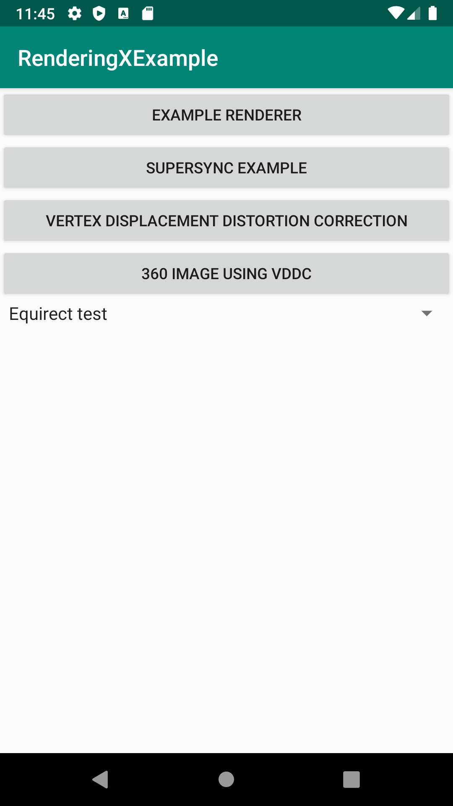
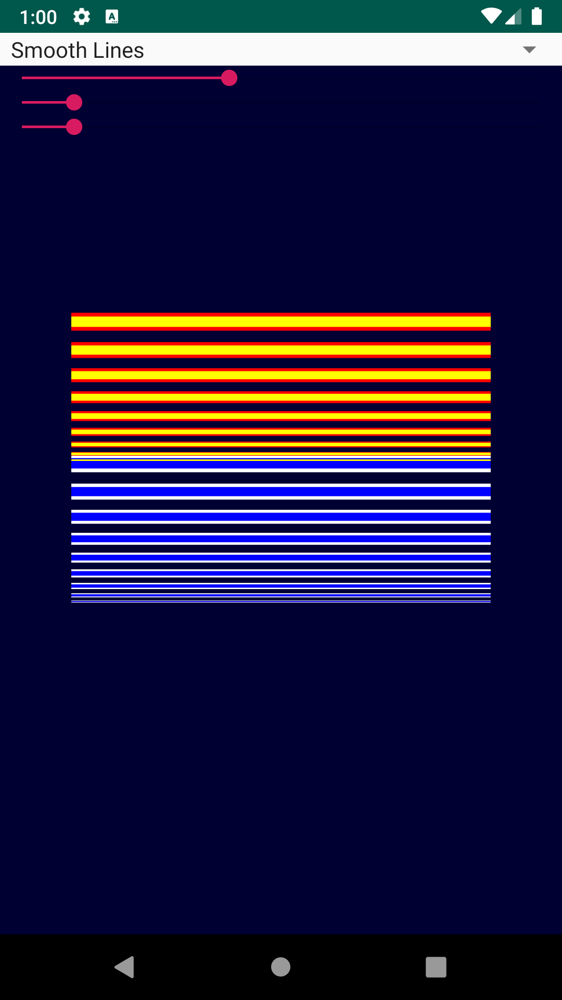

# RenderingX

[](https://jitci.com/gh/Consti10/RenderingX)

Core library (with example) for rendering smooth lines and Text with OpenGL.
Vertex displacment distortion correction
SuperSync

| Main screen | Smooth text |
| :---:  | :---: |
|  |  |

| Smooth icons | Smooth lines | Colored geometry
| :---:  | :---: | :---: |
|  |  |  |

| Example Vertex Displacement | Example 360 image |
| :---:  | :---: |
|  |  |


**Setup Dependencies** \
This project uses both .java and .cpp code. I recommend forking the whole project (Example and Core) and modifying Example to your need.
But If you want to include RenderingXCore in your own project, you can add the java code via gradle and cpp code via CMake:
* To your top level settings.gradle file, add
```
include ':RenderingXCore'
project(':RenderingXCore').projectDir=new File('..\\RenderingX\\RenderingXCore')
```
and modify the path according to your download file
* To your app level gradle file add
```
implementation project(':RenderingXCore')
```
* To your CMakeLists.txt file add 
```
include(${CMAKE_SOURCE_DIR}/../RenderingXCore/RenderingXCore.cmake)
```

See [FPV-VR](https://github.com/Consti10/FPV_VR_2018) as an example how to add dependencies.

